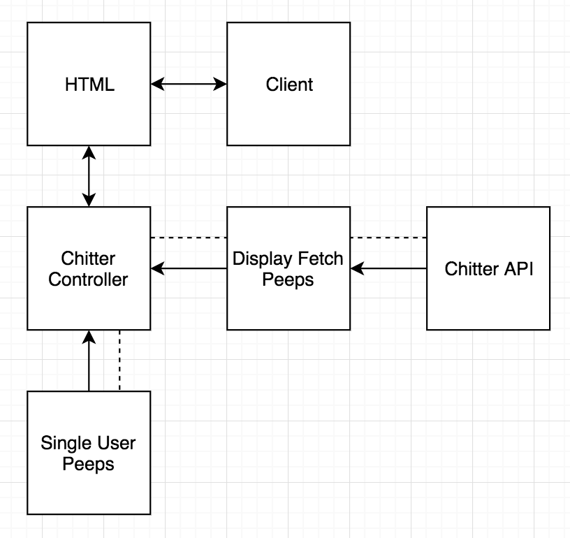

# Chitter API Challenge

The challenge this weekend was to work with an API, getting information and displaying it using a single page web app. Extended options included posting information to the API.

### User Stories

User stories covered over the weekend challenge.

```
As a user,
So I can see what everyone is peeping,
I want to be able to view all the peeps in reverse chronlogical order

As a user,
So I can only view the peeps of certain users,
I want to be able to select a user and view all their peeps

```

### Domain Model



### Testing

```
jasmine 3.2.1
```
All tests were written with the jasmine test library. I spent a lot of time researching and trying out methods to test the fetch function in isolation. I managed to test the promises and the general flow of data when fetch is used. Although I came across the use of async and await I did not use it in this challenge.

Running the tests:

```
SpecRunner.html
```

### Using the App
Currently the web app displays all the peeps on startup, if the user selects a peep it then displays all the peeps linked to that user handle and changes the displayed url to the user handle. This all happens on a single page with no full page refresh.

```
index.html
```
The code can be executed on a localhost by using

```
http-server
```
It can be installed through terminal
```
npm install http-server
```

### Thoughts on the challenge

I spent alot of time researching how promises work and touched on the aysnc and await functions within JavaScript. On top of this I spent a lot of time playing with how the asynchronous code works with the fetching of the API data. I only managed to complete the listing of the peeps on the main page and the selecting of peeps to display all those peeps linked to the user handle. I believe I tested the fetch function really well.

If I had more time I would have implemented the following user stories:

```
As a user,
So I can post my own peeps,
I want to be able to sign up to Chitter

As a user,
So I can let the world know what is on my mind,
I want to be able to post to Chitter

As a user,
So I can remove embarrassing late night peeps,
I want to be able to delete peeps
```
